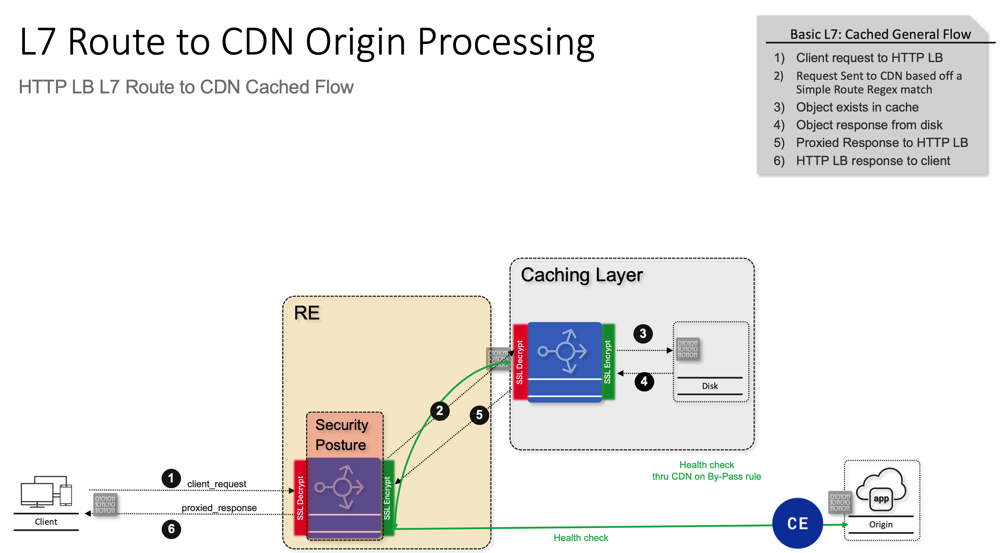

# F5 XC Regional Edge (RE) and Customer Edge (CE) Load Balancer with WAAP, Bot Defense, and CDN

This example demonstrates how to deploy a simple application on a Customer Edge (CE) site and protect it with F5 XC WAAP (Web Application and API Protection), Bot Defense, and CDN (Content Delivery Network) policies at the Regional Edge (RE).

## Prerequisites

- F5 XC Tenant
- F5 XC API Certificate
- AWS Account (for CE deployment)
- Terraform Cloud or Terraform CLI

## Inputs

| Name | Description | Type | Default | Required |
|------|-------------|------|---------|:--------:|
| `f5xc_api_url` | F5 XC API URL | `string` | n/a | yes |
| `f5xc_tenant` | F5 XC Tenant Name | `string` | n/a | yes |
| `f5xc_namespace` | F5 XC Namespace | `string` | n/a | yes |
| `f5xc_api_p12_file` | Path to F5 XC API Certificate File | `string` | n/a | yes |
| `app_domain` | Application Domain | `string` | n/a | yes |
| `site_name` | F5 XC CE Site Name | `string` | n/a | yes |
| `origin_dns_name` | Origin DNS Name | `string` | n/a | yes |

## Outputs

| Name | Description |
|------|-------------|
| `lb_dns_name` | DNS name of the load balancer |

## How to run

1. Clone the repository.
2. `cd examples/re-ce-lb-waap-bot-cdn`
3. Create a `terraform.tfvars` file and populate it with the required variables.
4. `terraform init`
5. `terraform plan`
6. `terraform apply`

## Verification

1. Access the application using the `lb_dns_name` output.
2. Verify that the application is accessible.
3. Verify that the WAAP and Bot Defense policies are enforced.
4. Verify that the CDN is caching the static content.

---
## Bot Protection Clarification

Here’s a clear breakdown of how **Bot Protection** works in **F5 Distributed Cloud (F5XC)**, depending on whether it is configured via a **WAF policy** or via the **HTTP Load Balancer (LB) configuration**:

---

### 1. **Signature-Based Bot Protection in WAF Policy**

**Definition:**
This is part of the **F5XC WAAP (Web Application & API Protection)** service. It uses **signature-based detection** within the WAF policy.

**How it works:**

* Relies on a **static signature database** of known bad bots (malicious crawlers, scrapers, vulnerability scanners, etc.).
* Matching is done based on request metadata such as:

  * User-Agent strings
  * Known patterns of malicious traffic
  * Header anomalies
* Primarily used for **blocking “known bad” automated traffic**.

**Pros:**

* Low overhead (simple signature matching).
* Effective against commodity bots and scanners.
* Easy to configure within WAF policy.

**Limitations:**

* **No behavioral analysis** – cannot detect sophisticated bots mimicking real users.
* Requires **regular signature updates** to stay current.
* Can be bypassed by bots that randomize headers or mimic legitimate clients.

**Reference:** [F5XC WAAP WAF protection docs](https://docs.cloud.f5.com/docs-v2/security/waap/waap-overview).

---

### 2. **Bot Protection in HTTP Load Balancer Configuration**

**Definition:**
This is the **advanced Bot Defense capability** built into the HTTP LB object. It provides **behavioral, JavaScript, and ML-driven detection**.

**How it works:**

* Injects **JavaScript challenges** or **mobile SDK challenges** into web/app flows.
* Uses **device/browser fingerprinting** and **behavioral analysis**:

  * Tracks mouse movements, keystroke dynamics, swipe/touch gestures.
  * Detects headless browsers, automation frameworks (e.g., Selenium, Puppeteer).
  * Identifies credential stuffing, account takeover, and scraping bots.
* Can enforce actions such as **block, redirect, or CAPTCHA**.

**Pros:**

* Detects **sophisticated human-like bots**.
* Provides **visibility and reporting** (good bot vs. bad bot classification).
* Can **differentiate between good bots** (Googlebot, Bingbot, partner APIs) and malicious automation.

**Limitations:**

* Higher complexity in deployment (JavaScript injection, SDK integration).
* Slight increase in client-side latency due to challenges.

**Reference:** [F5XC Bot Defense docs](https://docs.cloud.f5.com/docs-v2/security/bot-defense/overview).

---

### **Key Differences**

| Feature               | WAF Policy (Signature-Based Bot Protection)  | HTTP LB (Bot Defense)                                                        |
| --------------------- | -------------------------------------------- | ---------------------------------------------------------------------------- |
| **Detection Method**  | Static signatures of known bad bots          | Behavioral + JS/mobile SDK challenges + ML                                   |
| **Scope**             | Blocks “known bad” bots (scanners, crawlers) | Detects sophisticated automation (credential stuffing, scraping, fraud bots) |
| **Good Bot Handling** | Limited, mostly blocks                       | Can allowlist search engines, partner APIs                                   |
| **Flexibility**       | Simple, lightweight                          | Advanced, customizable enforcement                                           |
| **Use Case**          | Baseline protection against obvious bad bots | Comprehensive bot management for sensitive apps (login, checkout, APIs)      |

---

### **Best Practice**

* Use **WAF Signature-Based Bot Protection** as a **baseline layer** (blocks obvious noise).
* Enable **Bot Defense on HTTP LB** for **apps with high-value transactions** (logins, banking, e-commerce) where credential stuffing, scraping, or fraud is a concern.

---

## CDN Flow Clarification

## F5 Distributed Cloud (F5XC) — L7 Route to CDN Origin Processing

This diagram illustrates the **two possible traffic paths** when an F5XC **HTTP Load Balancer (WAAP)** is configured with an **L7 route** that forwards specific requests (e.g., static content) to a **CDN distribution**.  
The numbered callouts (①–⑥) in the image correspond to the detailed steps below.

---

## 1. Overview of Flow Types

| Flow Type | Description |
|------------|--------------|
| **Flow 1 – Route Match to CDN** | The HTTP LB identifies requests that match a specific L7 route (e.g., static assets) and forwards them to the CDN for caching and delivery. |
| **Flow 2 – No Route Match** | Requests that don’t match the CDN route (e.g., API calls, HTML) are sent directly to the origin application. |

---

## 2. Flow 1 – L7 Route Match (Static Content via CDN)

When the HTTP LB route matches static content (CSS, JS, JPG, etc.), the following occurs:

### **Step-by-Step Breakdown**

1. **Client → HTTP Load Balancer (WAAP)**
   - The client sends a request to the HTTP LB endpoint on the F5XC Regional Edge (RE).
   - SSL decryption occurs, and WAAP security policies (WAF, Bot Defense, DDoS) are applied.

2. **L7 Route Evaluation**
   - The HTTP LB evaluates request routes and detects a **regex match** for static content.
   - The request is forwarded to the **CDN distribution** (caching layer) defined as an origin.

3. **CDN Cache Check**
   - The CDN examines its cache index to determine if the object already exists.
   - Example: The requested image `logo.png` may already be cached.

4. **Cache Decision**
   - **Cache Hit:** The object is retrieved **from disk** within the CDN edge node.
   - **Cache Miss:** The CDN requests the content from the configured **origin (CE site)**.

5. **Proxy Response to HTTP LB**
   - The CDN returns the cached or freshly fetched object back to the HTTP LB on the RE.
   - SSL re-encryption occurs between the CDN and RE as part of secure proxying.

6. **HTTP LB → Client**
   - The HTTP LB returns the object to the client.
   - From the client’s perspective, the request completes at the same HTTP LB endpoint.

### **Flow Summary**

`Client → HTTP LB → CDN → (Cache/Origin) → HTTP LB → Client`

This flow optimizes delivery of static assets using CDN caching and offloads traffic from the origin.

---

## 3. Flow 2 – No Route Match (Dynamic Requests via Origin)

When the HTTP LB route does **not** match the CDN route (for example, HTML pages, APIs, or dynamic content):

### **Step-by-Step Breakdown**

1. **Client → HTTP Load Balancer (WAAP)**
   - The client request lands on the same HTTP LB endpoint.
   - SSL termination and WAAP policy inspection occur.

2. **L7 Route Evaluation**
   - No route match is found for the requested URI (e.g., `/api/v1/transactions`).
   - The HTTP LB forwards the request **directly to the origin pool** (the CE or backend service).

3. **Origin Response**
   - The backend application (origin) processes the request and sends a response to the HTTP LB.

4. **HTTP LB → Client**
   - The HTTP LB returns the origin’s response to the client.
   - This request **bypasses CDN entirely**, maintaining real-time interaction with the backend.

### **Flow Summary**

`Client → HTTP LB → Origin → Client`

This flow is ideal for dynamic, API-driven, or authenticated content that should not be cached.

---

## 4. Health Checks

- Health checks (shown in green in the diagram) are performed **from the CDN distribution to the origin (CE)**.
- These ensure backend availability even if the CDN route is configured for caching or bypass.

---

## 5. Key Takeaways

- The **HTTP LB** acts as the **decision point**, performing **L7 route evaluation** before determining whether to forward to the **CDN** or **Origin**.
- **CDN caching** reduces latency and offloads repetitive requests.
- **Direct-origin routing** ensures real-time processing for API or user-specific content.
- Both flows benefit from **end-to-end security posture** (TLS, WAF, Bot, and DDoS protection).

---

**References:**
- [F5XC HTTP Load Balancer (WAAP)](https://docs.cloud.f5.com/docs-v2/applications/http-load-balancer)
- [F5XC CDN Load Balancer](https://docs.cloud.f5.com/docs-v2/applications/cdn)
- [F5XC Caching and Route Policies](https://docs.cloud.f5.com/docs-v2/applications/caching)
